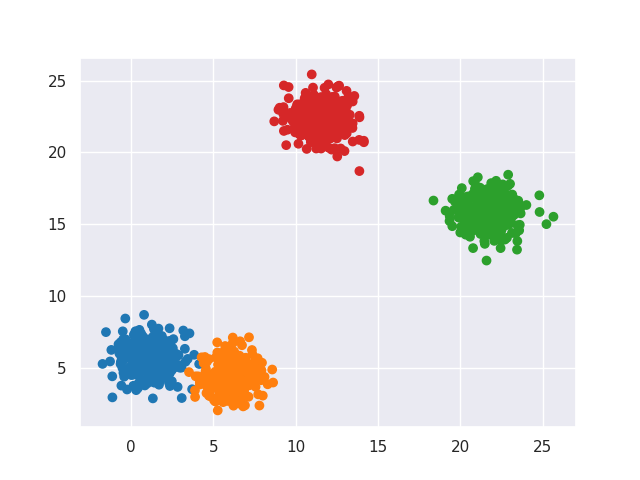

# K-Means Written N-Ways

_created by Austin Poor_

My goal here is to write the `k-means clustering algorithm` in multiple different languages.

All of my scripts will be clustering the same data, pictured above, with their true labels, and generated

NOTE-TO-SELF: Shuffle the data

_\<ADD K-MEANS PSEUDOCODE HERE>_

